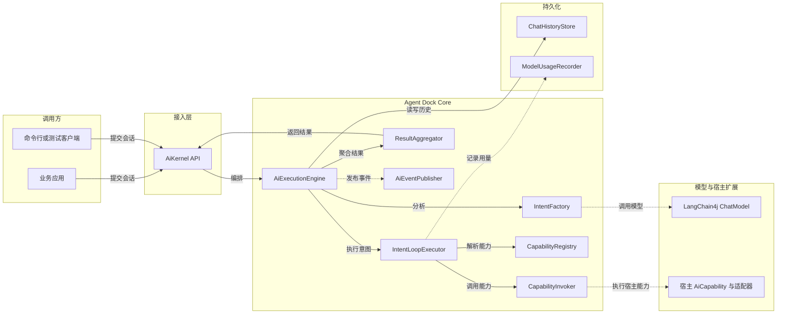
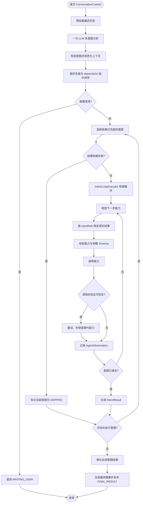

# Agent Dock

Agent Dock 是一个领域无关的企业 Agent 编排引擎。核心模块 `agent-dock-core` 不依赖 Spring、业务 Service 或 DAO，宿主应用通过注册意图、能力、模型适配器、历史存储和事件订阅完成接入。

## 模块结构

```text
agent-dock/
├── core/    通用 Agent 编排与执行内核
├── ui/      UI 集成模块（预留）
└── world/   宿主世界/扩展模块（预留）
```

当前 Maven 聚合工程实际构建 `core` 模块，产物为 `com.github.agent-dock:agent-dock-core:1.0.0-SNAPSHOT`。

## 核心架构



对应的可编辑 Mermaid 源文件见 [`docs/architecture.mmd`](docs/architecture.mmd)。

## 一次会话执行流程



对应的可编辑 Mermaid 源文件见 [`docs/execution-flow.mmd`](docs/execution-flow.mmd)。

## 关键设计

- 意图与能力分离：`IntentDefinition` 只描述用户目标；`CapabilityDefinition` 独立描述输入、输出、副作用、超时、重试、补偿和替代能力。
- 全局一次意图识别：`IntentFactory` 将注册的意图目录汇总后发起一次结构化分析，之后再由单意图 Loop 选择能力。
- 依赖驱动调度：意图通过 `dependsOn` 组成 DAG；`SERIAL` 模式保证兼容性，`PARALLEL` 模式只并行执行依赖已满足的意图。
- 真实结果绑定：`CapabilityInvocationBinder` 使用 RFC 6901 JSON Pointer 将前置意图或同一任务上一步的真实输出绑定到能力入参。
- 有限且可观测：Loop 最多 5 轮、12 次工具调用、2 分钟；每次模型调用、工具调用和状态变化都可通过 `AiEventPublisher` 与 `ModelUsageRecorder` 观测。
- 宿主负责组装：Spring、业务能力和持久化实现位于核心包之外，由宿主配置层注入。

## 宿主接入示例

```java
AiKernel kernel = new AiKernel()
        .registerIntent(new IntentDefinition("knowledge.search", "查询知识库"))
        .registerCapability(myCapability)
        .registerIntentAnalyzer(intentAnalyzer)
        .registerIntentLoopPlanner(loopPlanner)
        .registerChatHistoryStore(historyStore)
        .subscribe(event -> eventSink.publish(event));

ConversationResult result = kernel.execute(new ConversationContext(
        conversationId, executionId, userId, userInput, history, attributes));
```

## 构建

要求 JDK 21 及 Maven：

```bash
mvn -pl core -am package
```

核心包不包含业务测试和 Spring 启动逻辑；宿主应用应自行提供模型、能力实现、历史存储和事件转发。

